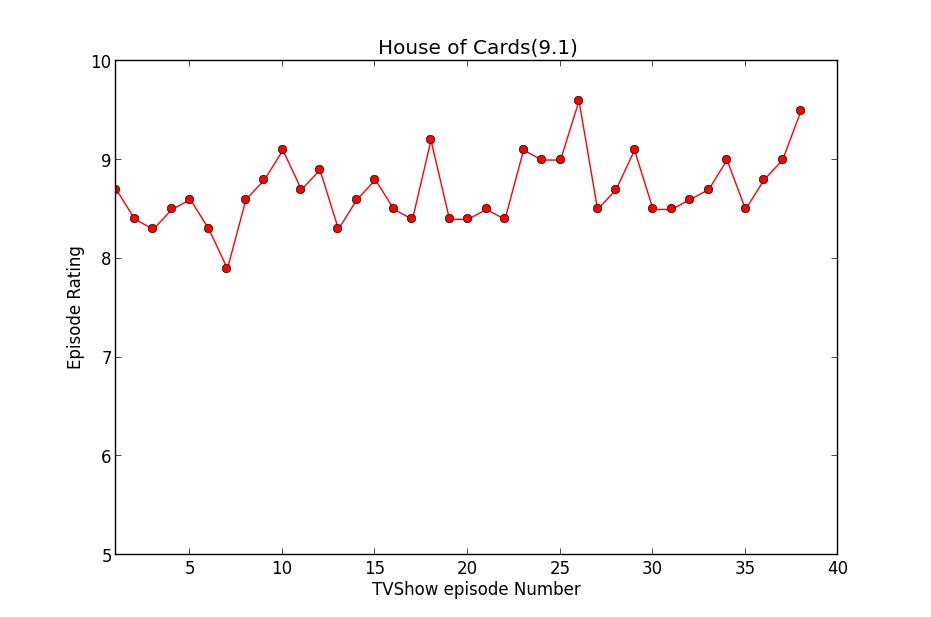
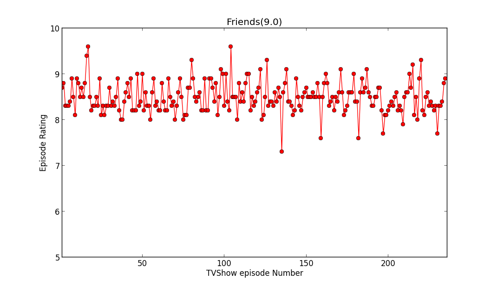
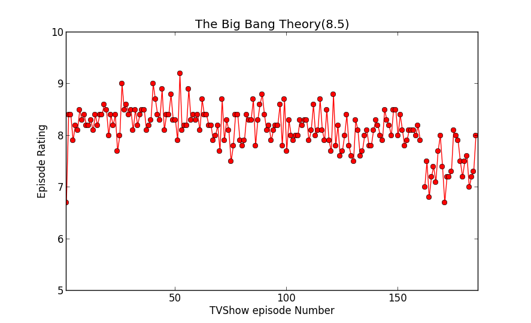

# TVSeriesRatingVisualization
Visualizing the TV Series Rating over the run of the Program. 
-----
The program visualizes the TV Series ratings over the season run. 
IMDB parsed JSON files are obtained that gives us the following data: 
<ul>
<li>Name of TV Show</li>
<li>Average Rating of the Series</li>
<li>Episode Information</li>
<ul>
<li>Season Numbering</li>
<ul>
<li>Episode Name</li>
<li>Episode Number in Season</li>
<li>Air Date</li>
<li>Episode Rating</li>
</ul>
</ul>
</ul>
 
We Extract the rating after converting the JSON to a dictioary structurea and then use matplotlib to visualize the range of the rating, updating 
various parameters like axis value, and the plot line style. 
------ 
Use: Just change the &lt;SeasonName&gt;.json to anny value and see the visualization, along with the structure of the JSON. 
License: Do What You Want With It License.  
ImageOutput: 
<ul>
<li>House Of Cards:</li>
  
<li>Friends:</li>
  
<li>The Big Bang Theory:</li>
  
</ul>
